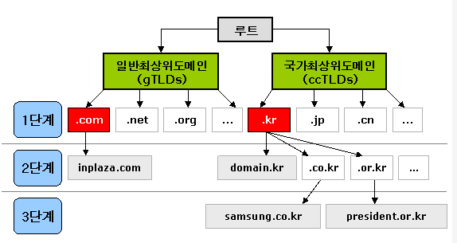

### DNS란?
- www.example.com과 같이 사람이 읽을 수 있는 이름을 192.0.2.1과 같은 숫자 IP 주소로 변환하여 컴퓨터가 서로 통신할 수 있도록 한다. 
인터넷의 DNS 시스템은 이름과 숫자 간의 매핑을 관리하여 마치 전화번호부와 같은 기능
- DNS 서버는 이름에 대한 요청을 IP 주소로 변환하여 최종 사용자가 도메인 이름을 웹 브라우저에 입력할 때 해당 사용자를 어떤 서버에 연결할 것인지를 제어한다. 이 요청을 쿼리라고 한다.

### 도메인

### 도메인 추적 과정
1. 웹 브라우저에 www.naver.com을 입력하면 먼저 Local DNS에게 "www.naver.com"이라는 hostname"에 대한 IP 주소를 질의하여  Local DNS에 없으면 다른 DNS name 서버 정보를 받음(Root DNS 정보 전달 받음)
2. Root DNS 서버에 "www.naver.com" 질의
3. Root DNS 서버로 부터 "com 도메인"을 관리하는 TLD (Top-Level Domain) 이름 서버 정보 전달 받음
4. TLD에 "www.naver.com" 질의
5. TLD에서 "name.com" 관리하는 DNS 정보 전달
6. "naver.com" 도메인을 관리하는 DNS 서버에 "www.naver.com" 호스트네임에 대한 IP 주소 질의
7. Local DNS 서버에게 "응! www.naver.com에 대한 IP 주소는 222.122.195.6 응답 
8. Local DNS는 www.naver.com에 대한 IP 주소를 캐싱을 하고 IP 주소 정보 전달 

### 출처
https://ijbgo.tistory.com/27 [한량 개발자]