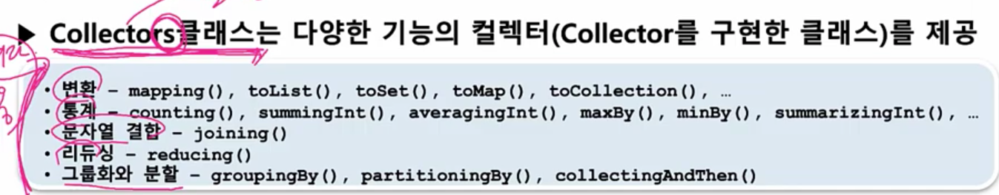

### Collectors 클래스
- Collectors 클래스 API
- 미리 작성된 다양한 종류의 컬렉터들을 지닌 클래스
- static 메소드를 통해 필요한 컬렉터를 반환한다



- Collectors.toList()
Stream에서 작업한 결과를 List로 반환받을 수 있다. 아래의 예제에서는 Stream의 요소들을 Product의 이름으로 변환하여, 그 결과를 List로 반환받고 있다.
```java
List<String> nameList = productList.stream()
    .map(Product::getName)
    .collect(Collectors.toList());
```
- Collectors.joining()
Stream에서 작업한 결과를 1개의 String으로 이어붙이기를 원하는 경우에 Collectors.joining()을 이용할 수 있다. Collectors.joining()은 총 3개의 인자를 받을 수 있는데, 이를 이용하면 간단하게 String을 조합할 수 있다.
delimiter : 각 요소 중간에 들어가 요소를 구분시켜주는 구분자
prefix : 결과 맨 앞에 붙는 문자
suffix : 결과 맨 뒤에 붙는 문자
```java
String listToString = productList.stream()
	.map(Product::getName)
	.collect(Collectors.joining());
// potatoesorangelemonbreadsugar

String listToString = productList.stream()
	.map(Product::getName)
	.collect(Collectors.joining(" "));
// potatoes orange lemon bread sugar

String listToString = productList.stream()
  	.map(Product::getName)
  	.collect(Collectors.joining(", ", "<", ">"));
// <potatoes, orange, lemon, bread, sugar>
```
- Collectors.averagingInt(), Collectors.summingInt(), Collectors.summarizingInt()
Stream에서 작업한 결과의 평균값이나 총합 등을 구하기 위해서는 Collectors.averagingInt()와 Collectors.summingInt()를 이용할 수 있다. 물론 총합의 경우 이를 구현할 수 있는 방법이 그 외에도 많이 있다.
```java
Double averageAmount = productList.stream()
	.collect(Collectors.averagingInt(Product::getAmount));

// 86
Integer summingAmount = productList.stream()
	.collect(Collectors.summingInt(Product::getAmount));

// 86
Integer summingAmount = productList.stream()
    .mapToInt(Product::getAmount)
    .sum();
```

- Collectors.groupingBy()
Stream에서 작업한 결과를 특정 그룹으로 묶기를 원할 수 있다. 이러한 경우에는 Collectors.groupingBy()를 이용할 수  있으며, 결과는 Map으로 반환받게 된다. groupingBy는 매개변수로 함수형 인터페이스 Function을 필요로 한다.

예를 들어 수량을 기준으로 grouping을 원하는 경우에 다음과 같이 작성할 수 있으며, 같은 수량일 경우에는 List로 묶어서 값을 반환받게 된다.
```java
Map<Integer, List<Product>> collectorMapOfLists = productList.stream()
  .collect(Collectors.groupingBy(Product::getAmount));

/*
{23=[Product{amount=23, name='potatoes'}, Product{amount=23, name='bread'}], 
 13=[Product{amount=13, name='lemon'}, Product{amount=13, name='sugar'}], 
 14=[Product{amount=14, name='orange'}]}
 */
```
- Collectors.partitioningBy()
Collectors.groupingBy()가 함수형 인터페이스 Function을 사용해서 특정 값을 기준으로 Stream 내의 요소들을 그룹핑하였다면, Collectors.partitioningBy()는 함수형 인터페이스 Predicate를 받아 Boolean을 Key값으로 partitioning한다.

예를 들어 제품의 갯수가 15보드 큰 경우와 그렇지 않은 경우를 나누고자 한다면 다음과 같이 코드를 작성할 수 있다.

```java
Map<Boolean, List<Product>> mapPartitioned = productList.stream()
	.collect(Collectors.partitioningBy(p -> p.getAmount() > 15));

/*
{false=[Product{amount=14, name='orange'}, Product{amount=13, name='lemon'}, Product{amount=13, name='sugar'}], 
 true=[Product{amount=23, name='potatoes'}, Product{amount=23, name='bread'}]}
 */
```